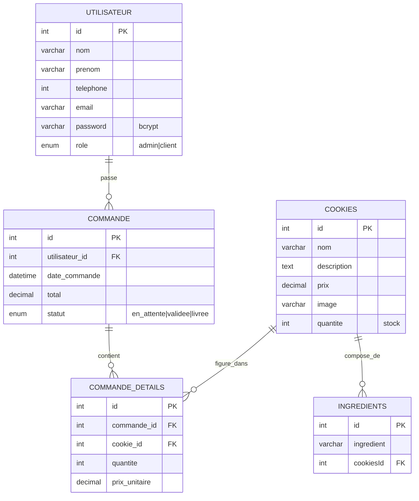

# L'art du Cookie — Cookies Shop

> Site e-commerce artisanal en **PHP natif (architecture MVC)** + **MySQL**, sans framework, sans Composer. Vitrine + panier + commande + back-office admin.

---

## 1. Présentation

Application web de vente de cookies artisanaux. Le visiteur consulte le catalogue, ajoute des produits au panier, se connecte (compte client) puis envoie sa commande à l'administrateur. L'admin reçoit toutes les commandes dans un dashboard et peut faire évoluer leur statut.

### Fonctionnalités principales
- Catalogue de cookies (liste + détails + ingrédients)
- Recherche en temps réel sur la page produits
- Panier en **session PHP** (pas de persistance BD côté client)
- Authentification 2 rôles : `client` et `admin`
- Passage de commande → enregistrement BD + notification visuelle à l'admin
- Dashboard admin : liste des commandes, détails, changement de statut
- UI moderne avec animations GSAP, curseur custom, fonts Google

---

## 2. Stack technique

| Couche | Techno |
|---|---|
| Backend | PHP 8.x natif, PDO MySQL |
| Base de données | MySQL 8.0 (`maisoncookies`) |
| Frontend | HTML5, CSS3 vanilla, JavaScript vanilla (pas de framework JS) |
| Animations | GSAP 3.12 + ScrollTrigger (CDN) |
| Icônes | Font Awesome 6 (CDN) |
| Fonts | Cormorant Garamond + DM Sans (Google Fonts) |
| Server local | `php -S` ou WAMP/MAMP/XAMPP |

**Aucune dépendance Composer / npm requise** (le `package.json` est minimal et inutilisé pour la prod).

---

## 3. Architecture MVC

L'app suit une structure MVC artisanale (sans router, sans autoloader) :

```
Cookies-Shop/
├── index.php                       ← page d'accueil (vue racine)
├── loading.php                     ← écran de chargement
├── maisoncookies.sql               ← dump initial de la BD
├── migrations.sql                  ← migrations (auth + commandes)
│
├── app/
│   ├── models/                     ← accès données (PDO)
│   │   ├── Database.php            ← connexion PDO singleton-like
│   │   ├── Product.php             ← classe `cookies` : list, getById
│   │   ├── Cart.php                ← panier en $_SESSION['panier']
│   │   ├── User.php                ← findByEmail, verifyLogin (bcrypt)
│   │   └── Order.php               ← create, listAll, getDetails, updateStatus
│   │
│   ├── controllers/
│   │   ├── CartController.php      ← endpoints AJAX panier (add/remove/update/clear)
│   │   ├── AuthController.php      ← login, logout, helpers (isLoggedIn, isAdmin, requireXxx)
│   │   └── OrderController.php     ← placeOrder, changeStatus
│   │
│   └── views/
│       ├── products/
│       │   ├── listCookies.php     ← catalogue
│       │   ├── cookiesDetails.php  ← fiche produit
│       │   ├── cart.php            ← panier
│       │   └── orderSuccess.php    ← confirmation après commande
│       ├── auth/
│       │   └── login.php           ← formulaire de connexion
│       └── admin/
│           ├── dashboard.php       ← liste de toutes les commandes
│           └── commandeDetails.php ← détail d'une commande
│
└── assets/
    ├── css/  (style.css, cart.css, produitdetails.css, auth.css)
    ├── js/   (script.js, cart.js, produitdetails.js)
    ├── images/
    └── videos/
```

### Pourquoi pas de router / autoloader ?
Choix volontaire de garder le projet **simple et lisible** pour un usage pédagogique. Chaque vue inclut elle-même son contrôleur/modèle via `require_once`.

---

## 4. Base de données

**Connexion** (voir [app/models/Database.php](app/models/Database.php)) :
- Host : `localhost:3306`
- DB : `maisoncookies`
- User : `root`
- Password : *(vide)*

### Schéma détaillé

```
┌─────────────────────────────────────────┐
│              utilisateur                │
├─────────────────────────────────────────┤
│ 🔑 id              INT  AUTO_INCREMENT  │
│    nom             VARCHAR(25)   NOT NULL│
│    prenom          VARCHAR(25)   NOT NULL│
│    telephone       INT           NOT NULL│
│    email           VARCHAR(50)   NOT NULL│
│    password        VARCHAR(255)  NOT NULL│  ← bcrypt
│    role            ENUM('admin','client')│
└─────────────────────────────────────────┘
                    │ 1
                    │
                    │ N
                    ▼
┌─────────────────────────────────────────┐
│               commande                  │
├─────────────────────────────────────────┤
│ 🔑 id              INT  AUTO_INCREMENT  │
│ 🔗 utilisateur_id  INT     FK → utilisateur(id)
│    date_commande   DATETIME  DEFAULT NOW()│
│    total           DECIMAL(10,2) NOT NULL│
│    statut          ENUM('en_attente',    │
│                         'validee',       │
│                         'livree')        │
└─────────────────────────────────────────┘
                    │ 1
                    │
                    │ N
                    ▼
┌─────────────────────────────────────────┐         ┌─────────────────────────────────────┐
│           commande_details              │         │              cookies                │
├─────────────────────────────────────────┤  N   1  ├─────────────────────────────────────┤
│ 🔑 id              INT  AUTO_INCREMENT  │◄────────│ 🔑 id           INT  AUTO_INCREMENT │
│ 🔗 commande_id     INT  FK → commande   │         │    nom          VARCHAR(255) NOT NULL│
│ 🔗 cookie_id       INT  FK → cookies    │         │    description  TEXT                 │
│    quantite        INT           NOT NULL│         │    prix         DECIMAL(10,2) NOT NULL│
│    prix_unitaire   DECIMAL(10,2) NOT NULL│         │    image        VARCHAR(255)         │
└─────────────────────────────────────────┘         │    quantite     INT  DEFAULT 0       │
                                                     └─────────────────────────────────────┘
                                                                       │ 1
                                                                       │
                                                                       │ N
                                                                       ▼
                                                     ┌─────────────────────────────────────┐
                                                     │            ingredients              │
                                                     ├─────────────────────────────────────┤
                                                     │ 🔑 id          INT  AUTO_INCREMENT  │
                                                     │    ingredient  VARCHAR(255) NOT NULL│
                                                     │ 🔗 cookiesId   INT  FK → cookies    │
                                                     └─────────────────────────────────────┘
```

### Relations (cardinalités)

| Relation | Cardinalité | Sens métier |
|---|---|---|
| `utilisateur` → `commande` | 1 : N | Un utilisateur peut avoir plusieurs commandes |
| `commande` → `commande_details` | 1 : N | Une commande contient plusieurs lignes |
| `cookies` → `commande_details` | 1 : N | Un cookie peut apparaître dans plusieurs commandes |
| `cookies` → `ingredients` | 1 : N | Un cookie a plusieurs ingrédients |

### Contraintes de clés étrangères

```sql
-- ingredients → cookies
FOREIGN KEY (cookiesId) REFERENCES cookies(id) ON DELETE CASCADE ON UPDATE CASCADE

-- commande → utilisateur
FOREIGN KEY (utilisateur_id) REFERENCES utilisateur(id) ON DELETE CASCADE ON UPDATE CASCADE

-- commande_details → commande
FOREIGN KEY (commande_id) REFERENCES commande(id) ON DELETE CASCADE ON UPDATE CASCADE

-- commande_details → cookies
FOREIGN KEY (cookie_id) REFERENCES cookies(id) ON DELETE CASCADE ON UPDATE CASCADE
```

### Vue Mermaid (rendu graphique sur GitHub/GitLab)



### Résumé des 5 tables

| Table | Rôle | Lignes initiales |
|---|---|---|
| `utilisateur` | Comptes (clients + admin) | 3 |
| `cookies` | Catalogue produits | 10 |
| `ingredients` | Composition de chaque cookie | ~100 |
| `commande` | En-tête de commande (1 par achat) | 0 |
| `commande_details` | Lignes de commande (N par commande) | 0 |

### Comptes pré-installés

| Email | Mot de passe | Rôle |
|---|---|---|
| achraf@gmail.com | achraf123 | admin |
| khaled@gmail.com | khaled123 | client |
| naceur@gmail.com | naceur123 | client |

> Mots de passe stockés en **bcrypt** (`password_hash` / `password_verify`).

### Importer la BD à zéro

```bash
mysql -u root maisoncookies < maisoncookies.sql
mysql -u root < migrations.sql
```

---

## 5. Installation / lancement

### Prérequis
- PHP ≥ 8.0
- MySQL ≥ 8.0
- (optionnel) phpMyAdmin

### Démarrage rapide
```bash
# 1. Cloner le repo
git clone <url> Cookies-Shop

# 2. Importer la BD (voir section 4)

# 3. Lancer le serveur PHP local depuis le dossier PARENT
#    (impératif car les liens internes utilisent /Cookies-Shop/...)
cd ..
php -S localhost:8000

# 4. Ouvrir
open http://localhost:8000/Cookies-Shop/index.php
```

> ⚠️ Les redirections (login, logout, place order) utilisent des chemins absolus `/Cookies-Shop/...`. Si tu déploies dans un autre dossier, il faudra adapter les `header('Location: /Cookies-Shop/...')` dans :
> - [AuthController.php](app/controllers/AuthController.php)
> - [OrderController.php](app/controllers/OrderController.php)

### Avec WAMP/XAMPP/MAMP
Place le dossier `Cookies-Shop` dans `htdocs/` (ou équivalent), puis ouvre `http://localhost/Cookies-Shop/index.php`.

---

## 6. Système d'authentification

### Helpers disponibles ([AuthController.php](app/controllers/AuthController.php))

```php
AuthController::isLoggedIn()    // bool
AuthController::isAdmin()       // bool
AuthController::requireLogin($redirect = null)  // redirige si non connecté
AuthController::requireAdmin()                  // redirige si non admin
```

### Données stockées en session après login
```php
$_SESSION['user'] = [
    'id'     => int,
    'nom'    => string,
    'prenom' => string,
    'email'  => string,
    'role'   => 'admin' | 'client',
];
```

### Protéger une nouvelle page
```php
require_once(__DIR__ . '/../../controllers/AuthController.php');
AuthController::requireLogin();   // ou requireAdmin()
```

### Logout
```html
<a href="/Cookies-Shop/app/controllers/AuthController.php?action=logout">Déconnexion</a>
```

---

## 7. Flux de commande

```
[Client connecté]
   │
   ▼ ajoute des produits → CartController (AJAX) → $_SESSION['panier']
   │
   ▼ va sur cart.php → clique "Passer la commande"
   │
   ▼ POST /Cookies-Shop/app/controllers/OrderController.php?action=place
   │
   ├── AuthController::requireLogin('cart')
   │   └── si non connecté → /auth/login.php?redirect=cart
   │
   ├── lit Cart::getItems()
   ├── Order::create($userId, $items)
   │   ├── INSERT commande (statut='en_attente')
   │   ├── INSERT commande_details (1 ligne par produit)
   │   └── COMMIT (transaction)
   ├── Cart::clear()
   │
   ▼ redirige vers orderSuccess.php

[Admin connecté]
   │
   ▼ /admin/dashboard.php → voit toutes les commandes (Order::listAll)
   ├── change statut via formulaire → OrderController?action=status
   └── clique "Détails" → /admin/commandeDetails.php?id=X (Order::getDetails)
```

---

## 8. Convention de code & points d'attention

### À FAIRE quand tu touches au code
- **Toujours utiliser PDO préparé** (`$db->prepare(...)->execute([...])`) pour toute nouvelle requête. Voir [Order.php](app/models/Order.php) comme référence.
- **Échapper toute sortie** avec `htmlspecialchars()` dans les vues.
- **Hasher les mots de passe** avec `password_hash($pwd, PASSWORD_DEFAULT)` (jamais en clair).

### Dette technique connue (à corriger un jour)
- [Product.php:23-24](app/models/Product.php#L23-L24) → requête concaténée avec `$id` (risque SQL injection). À convertir en prepared statement.
- Pas de protection CSRF sur les formulaires login / passage commande / changement statut.
- Les redirections en dur sur `/Cookies-Shop/...` (voir section 5).
- `package.json` quasi vide → à supprimer ou compléter selon la stratégie front.
- Pas de gestion de stock côté commande (le stock dans `cookies.quantite` n'est pas décrémenté quand une commande est validée).

### Conventions
- Noms de classes PHP : `PascalCase` (sauf `cookies` historique → à renommer `Product`).
- Noms de méthodes : `camelCase`.
- Vues : extension `.php`, encodage UTF-8.
- CSS : un fichier par "module" (`style.css` global, `cart.css`, `auth.css`, `produitdetails.css`).
- JavaScript : pas de bundler — fichiers chargés directement avec `defer`.

---

## 9. Endpoints / actions importants

| URL / Action | Méthode | Description |
|---|---|---|
| `/index.php` | GET | Accueil + 4 cookies en vedette |
| `/app/views/products/listCookies.php` | GET | Catalogue complet |
| `/app/views/products/cookiesDetails.php?id=X` | GET | Fiche produit |
| `/app/views/products/cart.php` | GET | Panier |
| `/app/controllers/CartController.php` | POST | AJAX (`action=add\|remove\|update\|clear\|get`) |
| `/app/views/auth/login.php` | GET/POST | Formulaire de connexion |
| `/app/controllers/AuthController.php?action=logout` | GET | Déconnexion |
| `/app/controllers/OrderController.php?action=place` | POST | Crée la commande à partir du panier |
| `/app/controllers/OrderController.php?action=status` | POST | Admin : change statut commande |
| `/app/views/admin/dashboard.php` | GET | Liste des commandes (admin) |
| `/app/views/admin/commandeDetails.php?id=X` | GET | Détail commande (admin) |

---

## 10. Documentation annexe

- [CART_DOCUMENTATION.md](CART_DOCUMENTATION.md) — détails sur l'implémentation du panier
- [INSTALLATION_PANIER.txt](INSTALLATION_PANIER.txt) — guide d'install historique
- [PANIER_DEBUG.txt](PANIER_DEBUG.txt) — pistes de debug panier

---

## 11. TL;DR pour quelqu'un qui débarque

1. **Clone** + importe `maisoncookies.sql` puis `migrations.sql` dans MySQL.
2. **Lance** `php -S localhost:8000` depuis le dossier *parent* de `Cookies-Shop`.
3. **Ouvre** `http://localhost:8000/Cookies-Shop/index.php`.
4. **Connecte-toi** avec un des comptes (section 4) — admin pour voir le back-office, client pour passer commande.
5. **Lis** ce fichier section par section quand tu touches à une partie du code.

Pour toute question : commence par lire [AuthController.php](app/controllers/AuthController.php) (auth), [OrderController.php](app/controllers/OrderController.php) (commandes), [Cart.php](app/models/Cart.php) (panier). Le reste se devine en lisant le code.
